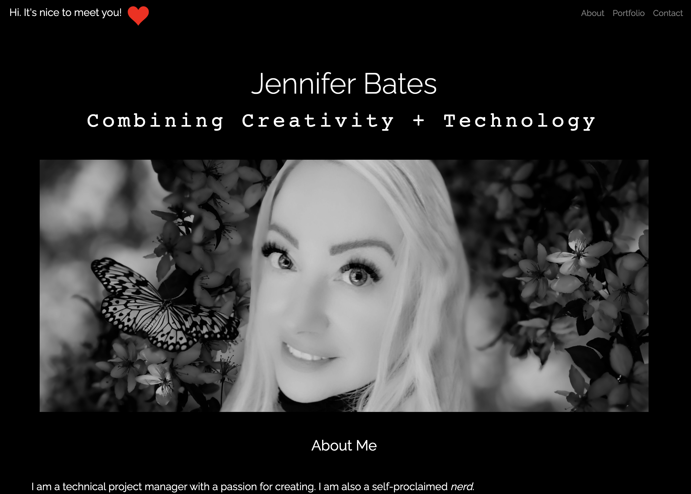
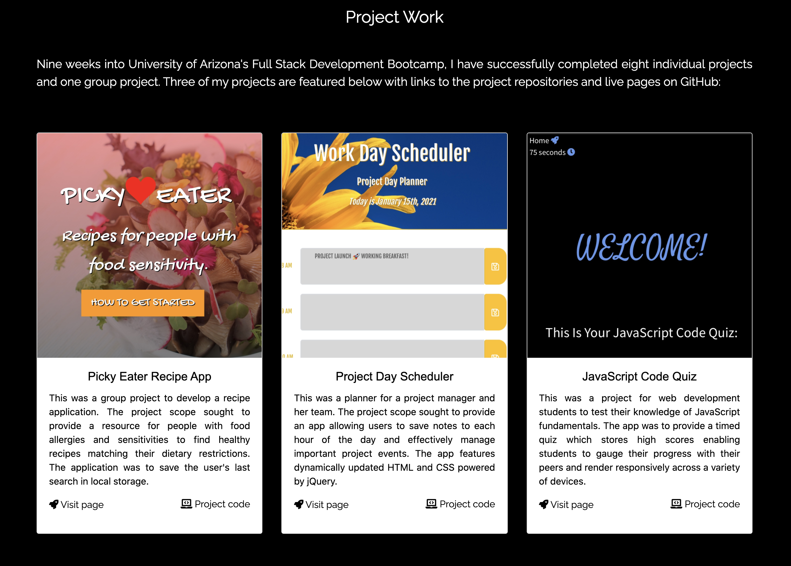

      

# Porfolio Refactor Project <br>

## Table of Contents
1. [About The Project](#About-The-Project)
1. [Project Links](#Project-Links)
1. [Demo](#Demo)
1. [Getting Started](#Getting-Started)
1. [Project Status](#Project-Status)
1. [License](#License)

## About The Project

#### This was a refactor of my initial portfolio created at the beginning of my coding journey two months ago! The project scope sought to provide XXXXXX. The portfolio was to have XXXXXX. It was also to have a clean and polished user interface rendering responsively across a variety of devices. 

## Project Links
[GitHub Project Link](https://onomatopoetica.github.io/portfolio-refactor/)<br>
[Repo Link](https://github.com/onomatopoetica/portfolio-refactor)

## Acceptance Criteria

```
GIVEN LOREM IPSUM...

```
## Demo

##### This video clip demonstrates the portfolio's rendering and functionality on a mobile device. <br>

  

##### The following are screenshots of the portfolio and overview of its functionality: <br>

 <br>
 <br>
 <br>

## Getting Started

#### Languages and libraries used in this project:
* HTML
* CSS
* JavaScript
* Bootstrap 4

#### Installation - Clone the repo: <br>
   ``` 
   git clone https://github.com/onomatopoetica/portfolio-refactor.git
   ```

## Project Status
<details>
    <summary>Project Status</summary>
    Active
</details>
<details>
    <summary>Contact</summary>
    jendotb@gmail.com
</details>

#### Articles and sites which contributed toward the successful completion of this project are included below:

[Coding Yaar](https://codingyaar.com/) <br>
[GeeksForGeeks JavaScript Tutorials](https://www.geeksforgeeks.org/loops-in-javascript/?ref=lbp) <br>

## License
##### Distributed under the MIT License. See `LICENSE` for more information.
